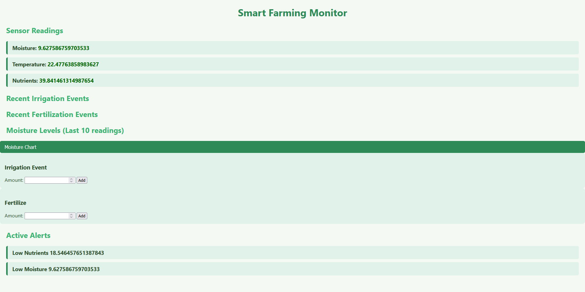
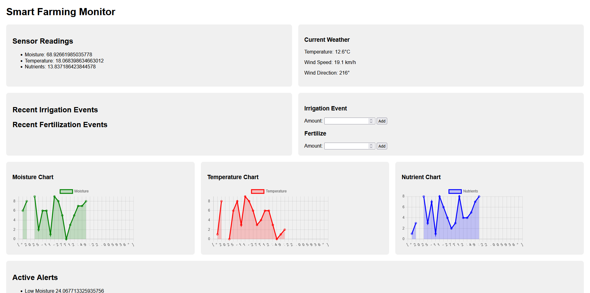

# HEY! IF YOU WANT TO VIEW THIS PROJECT CLICK THE LINK 🔻

https://prog2200-w0494713-liam-matheson-final.onrender.com/dashboard

# Smart Farming Manager
**Liam Matheson**

---

## Description

- Tracks soil sensors, irrigation events, fertilizer logs, and automated alerts for low moisture.

---

## Features

- Gets live weather data from [Open-Meteo](https://api.open-meteo.com). Location is currently set to Halifax, Nova Scotia.  
- 3 sensors create fake data every 5 seconds and save to the database. The webpage retrieves this data.  
- If sensor data does not fall within thresholds, an alert is generated.

---

## Changelog

### v1.0
- Added 3 sensors faked with data generated through threading  
- Recent irrigation and nutrient events  
- Can input new events that show up on the page  
- Single chart for moisture (other charts to be added next)  
- Alerts appear at the bottom
  

### v2.0
- New look with flexbox  
- Added two more charts for temperature and nutrients  
- Weather widget now gets live data from [Open-Meteo](https://api.open-meteo.com)
  

---

## Installation

# OPTION 1 - EASY

- Visit https://prog2200-w0494713-liam-matheson-final.onrender.com/dashboard
- The webpage may take a minute to load but you can view it right in the browser.

# OPTION 2

- Clone the repo
- Run the .jar file. It is in the root folder.
- Access the program: open your browser and go to http://localhost:8080
